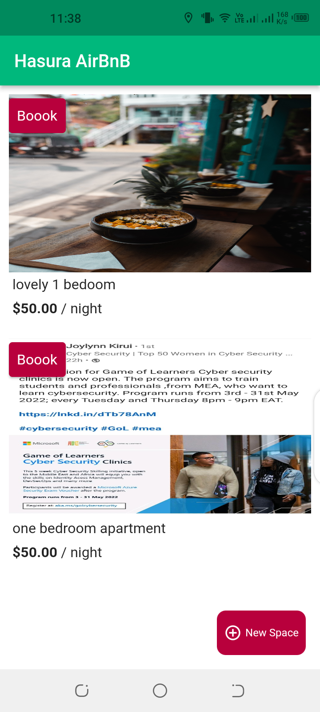
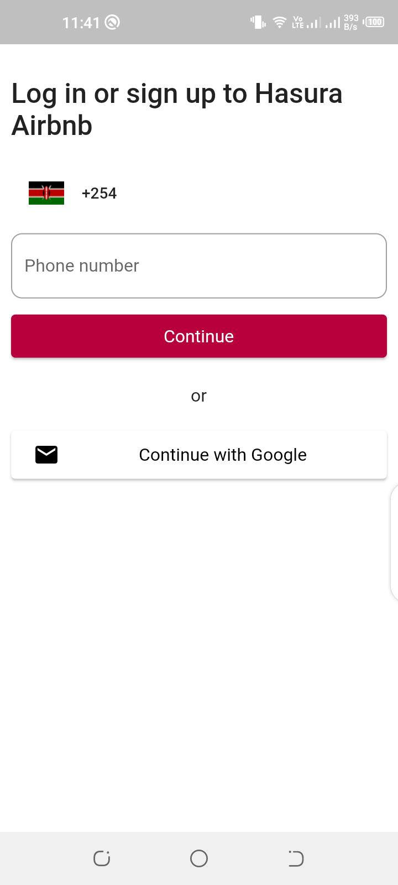
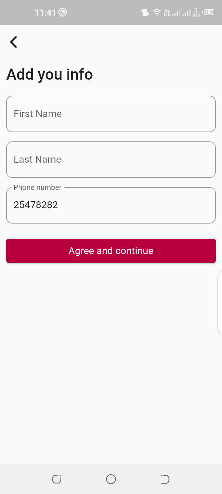

# hashnode_hasura_hackathon

This is a submission for the hasura hashnode hackathon.

https://ndungudedan.hashnode.dev/airbnb-clone-app-with-hasura-graphiql-infrastructure

## Getting Started

1. Clone the repository.
2. Create a .env file on the root folder.
3. Add the following line of code

GOOGLE_API_KEY='Your Google maps api key'

- [Get a Google Maps Api Key from here](https://cloud.google.com/maps-platform/)

![Hasura AirBnB]

![home]

![login]

![signup]

